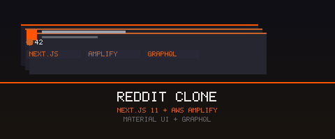

<div align="center">
  

  [](https://nextjs.org/)
  [](https://aws.amazon.com/amplify/)
  [](https://graphql.org/)
  [](https://v4.mui.com/)

  **🤖 Reddit clone — first iteration — Next.js 11 + AWS Amplify + GraphQL ⬆️**

</div>

---

> Earlier version of the project, built on Next.js 11 with Material UI v4. See [`reddit-clone-next12-amplify-youtube-task3`](https://github.com/ajsevillano/reddit-clone-next12-amplify-youtube-task3) for the updated version.

## ✨ Features

- 📝 **Create and browse posts**
- 🔐 **User authentication** via AWS Cognito
- 📡 **GraphQL API** via AWS AppSync
- 🎨 **Material UI v4** components

## 🚀 Quick Start

```bash
# Install dependencies
npm install

# Initialize and deploy Amplify backend
amplify init && amplify push

# Run the app
npm run dev
```

## 🛠️ Tech Stack

- **Next.js 11**
- **AWS Amplify v4** — AppSync + Cognito
- **Material UI v4**
- **react-hook-form**
